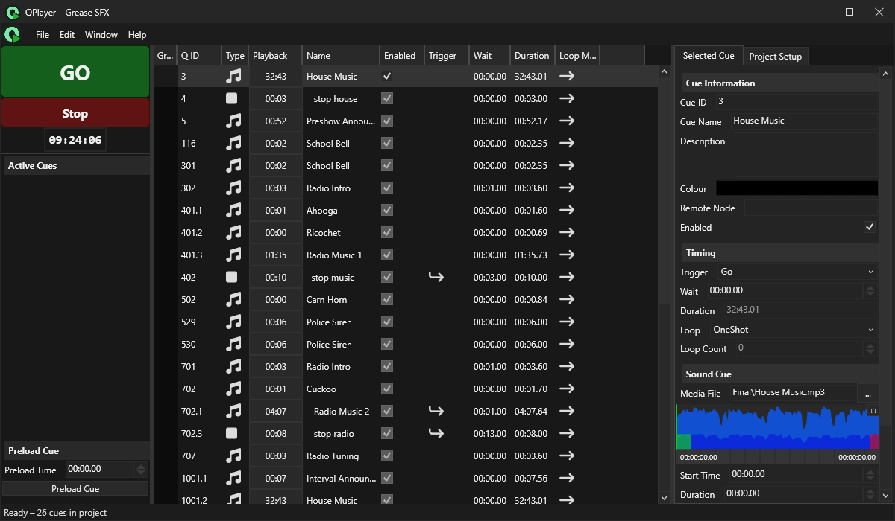
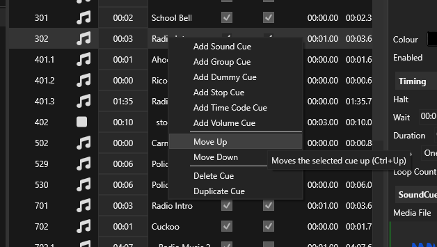
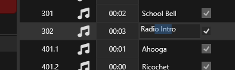
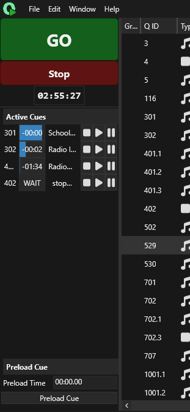

import { Kbd } from 'starlight-kbd/components'

The heart of QPlayer is the cue stack, this is where all media cues, and any other 
action that can be triggered by the GO button live. This is an ordered list of all
the cues in the project. For each cue, some common properties are displayed, most 
of these are described in more depth on the [Common Cue Properties](../cues/cue)
page.

## Playing Cues

When you press the GO button (<Kbd mac="Space" windows="Space"/>) the currently 
selected cue, the one highlighted in the cue stack, is played. When a cue is fired
the next cue in the cue stack is selected. To all active cues in an emergency,
the Stop button can be pressed (<Kbd mac="Esc" windows="Esc"/>). All active cues
are displayed in a list in the left hand panel, from there they can individually be
stopped, paused, and resumed. To pause all active cues, the keyboard shortcut
<Kbd mac="[" windows="["/> can be used pressing the <Kbd mac="]" windows="]"/>
resumes all active cues.

Cues can be selected in the cue stack by left clicking on them, or you can select
the previous cue by pressing <Kbd mac="Up" windows="Up"/> on the keyboard, or
<Kbd mac="Down" windows="Down"/> to select the next cue in the stack.

The `Playback` column in the cue stack, displays the duration current playback
progress of the cue. A cue can be "preloaded" to a specified playback time by 
selecting the cue, entering a `Preload Time` in the preload panel in the 
bottom-left of the main window, and pressing `Preload Cue`. This puts the cue
into a "paused" state at the playback time specified by `Preload Time`.

## Creating and Editing Cues

There a few ways to create a cue in QPlayer. The simplest is to right click in
the cue stack on the cue before where you want to insert a cue, this brings up
the cue context menu:

From here you can press "Add [Cue Type] Cue" to add the desired cue to the stack.
Cues can also be created by going to the `Edit/Create Cue/Add [Cue Type] Cue` menu,
or by pressing <Kbd mac="Cmd+T" windows="Ctrl+T"/> which also brings up a cue 
creation menu.

To quickly create cues for a collection of sound files, these sound files can be drag 
and dropped onto the cue stack. QPlayer will automatically create a cue for each sound 
file in the ordered that it was selected in.

Created cues can be duplicated by pressing <Kbd mac="Cmd+D" windows="Ctrl+D"/>,
or by using the button in the right-click menu. They can also be deleted by 
pressing <Kbd mac="Delete" windows="Delete"/>, or by using the right click menu.

Cues can be reordered in the cue stack, by dragging and dropping them, or by using
the keyboard shortcuts <Kbd mac="Cmd+Up" windows="Ctrl+Up"/> and
<Kbd mac="Cmd+Down" windows="Ctrl+Down"/>. Note that reordering cues in the cue stack
will result in them being renumbered, this can have an effect on cues which reference
other cues by Cue ID. See the [Cue ID](../cues/cue#cue-id) page for more information
on Cue IDs.

{/*

*/}
