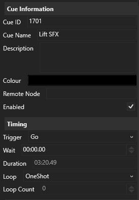

All cues in QPlayer share a few common properties which are described here. These 
properties can be edited in the `Selected Cue` tab, or for some properties directly
from the cue stack. Additional properties, specific to each cue type are listed in
the `Selected Cue` tab directly after the common properties described here, these 
properties are described in more detail in the subsequant pages of this manual.

## Cue Information

### Cue ID

This is the decimal number which identifies this cue. Other cues and OSC messages
might reference this cue by it's Cue ID, when changing the Cue ID be sure to check
that other cues referencing it have been updated correctly.

Cue IDs should be unique within a cue stack and should be in ascending order in the
cue stack. 

:::caution
Currently, QPlayer doesn't stricly enforce order or uniqueness of Cue IDs to 
make editing easier, but having duplicate or out of order cues, can result in 
unexpected behaviour.
:::

### Cue Name

A short name for this cue to make it easy to identify in the cue stack.

### Description

A longer description of this cue, or any other notes you might want to leave in this
cue.

### Colour

An accent colour to give the cue in the cue stack to make it easier to identify.

:::note
This feature is currently unimplemented.
:::

### Enabled

Whether this cue is enabled or not. Pressing GO on a disabled cue has no effect.
If a cue is disabled it is automatically skipped when advancing the selected cue
after pressing GO.

## Timing

### Halt

When disabled, this cue is triggered with the previous cue when it is started. 
When the GO button is pressed, the selected cue is triggered as well as all 
subsequant cues until a cue with Halt enabled are triggered.

This can be used to group multiple cues together to start at once or 
automatically, one after the other.

## Wait

When the cue is triggered, it waits for the specified amount of time before 
actually starting playback. This can be used with `Halt` disabled to 
autmatically chain multiple cues together.

## Duration

(Read-only) Shows the computed duration of this cue. To set the duration of this 
cue, edit the relevant property specific to the type of cue being edited.

## Loop

The looping behaviour of this cue, can be one of the following:  
**`OneShot`** -- This cue is played once when triggered.  
**`Looped`** -- This cue plays in a loop for a number of loops specified 
by the `Loop Count` property.  
**`LoopedInfinite`** -- This cue plays in a loop forever, until it is stopped 
manually.

## Loop Count

The number of times this cue should be looped. Requires the `Loop` mode to be set
to `Looped`.
