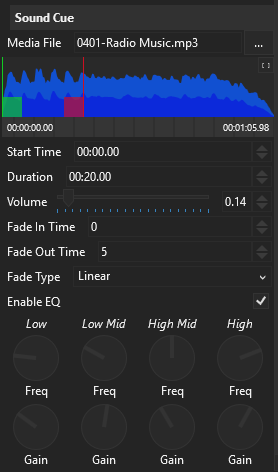
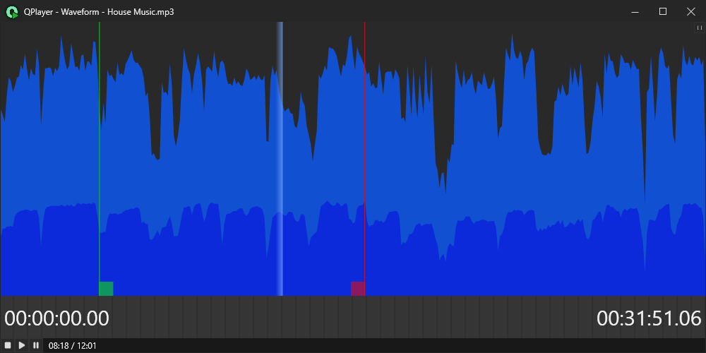

Sound cues allow the playback of a single audio file. The sound cue provides a 
few basic parameterised features to customise playback, these are listed below.

### Media File
This field stores the path to the audio file to be played. To browse for an audio
file, press the `...` button to open a file browser. QPlayer will automatically 
make file paths in this field relative to the directory containing the QPlayer 
project (eg: if the project file is in `C:\Projects\MyProj.qproj` and you specify 
a media file at `C:\Projects\Media\audio.mp3`, then QPlayer will rewrite it as 
`Media\audio.mp3`), this allows for better portability if a QPlayer project is 
moved to another directory. If a media file can't be found at the given path, 
QPlayer will automatically search for it in the project directory and all 
subdirectories.

The following audio file formats are supported:
 - .mp3
 - .wav
 - .aiff
 - .flac
 - .ogg
 - .wma

### Waveform Viewer
Once an audio file is loaded, it's waveform is displayed in the waveform viewer.
This can make it easier to find start and end points in the audio file. In the 
waveform display, the light-blue waveform represents the peak volume and the 
dark-blue represents the RMS volume (which is closer to the perceived loudness).

Dragging the green marker (using the square handle at the bottom), allows the 
[start time](#start-time) to be set. The red marker can also be dragged to set 
the [duration](#duration) of the cue.

To zoom/pan the waveform click and drag on the ruler at the bottom of the 
waveform, dragging up and down zooms in and out, and dragging left and right
pans the view of the waveform left and right. 

You can also press the `[]` button in the top corner of the waveform to open a
large preview of the waveform in a separate window:

To speed up waveform rendering, QPlayer stores a compressed version of the 
computed waveform next to each loaded audio file in a `.qpek` file. These can 
safely be deleted at any time, QPlayer will simply regenerate the file on demand.

### Start Time
This sets the time at which the audio file should start playing. Use this to trim 
the start of an audio file.

### Duration
This sets the total duration of the audio file to be played. This includes the 
[fade-in](#fade-in-time) and [fade-out](#fade-out-time) time, but doesn't include 
the time skipped by [Start Time](#start-time). Use this to trim the end of an audio
file.

### Volume
This sets the playback volume of the audio file, it's set as a simple multiplier 
of the audio file's native volume. A value of `1` represents no change to the file's
full-scale volume.

### Fade In Time
This sets a fade in time for the cue in seconds. 

### Fade Out Time
This sets a fade out time for the cue in seconds. Note that the total duration of the 
cue specified in [Duration](#duration) will still be respected, hence for a fade out 
time of *n* seconds, the fade out will start *n* seconds before the total duration 
of the cue.

:::note
If this cue is stopped using a [Stop Cue](../stop-cue), then the stop cue's fade out 
time will be used instead of this cue's fade out time.

Additionally, if this cue is stopped using the main `STOP` button (or a stop OSC 
command), then no fade out will occur.
:::

### Fade Type
This specifies the shape of the curve used to fade in/out the audio file. The following
fade curves are available:
 - **Linear** -- a simple linear fade.
 - **SCurve** -- an S shaped fade, with a slow start and slow end. (Implemented as a 
                 quadaratic hermite spline)
 - **Square** -- a square-law fade, with a slow start and fast end.
 - **InverseSquare** -- an inverse square-law fade, with a fast start and a slow end.
