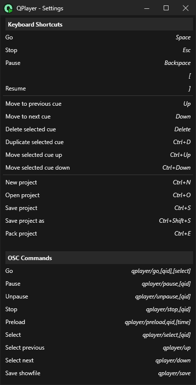

---
title: OSC Reference
order: 30
---

QPlayer can be controlled from external applications over the network using 
[OSC messages](http://opensoundcontrol.org/). At the moment only UDP OSC messages are 
supported. Configuration settings for sending and receiving OSC messages can be found
in the [Project Setup](../project-setup).

QPlayer can also remote control other instances of itself or compatible applications 
over OSC. This can be useful if you need to control multiple media players from a 
single computer. See the [OSC Remote](#osc-remote) section for more details.

## Received Messages

The following OSC messages can be received by QPlayer:

#### Anatomy of an OSC message:

```
    /qplayer/test,(param1),[param2]
    ↓             |        |
    OSC Address   ↓        |
                  First argument
                           ↓
                           Second argument (optional)
```

An OSC message is comprised of an *address*, which may be made up of multiple parts 
separated by `/` characters. This is followed by any number of *arguments* which
may be an integer, a decimal, a string, or one of the other types specified 
[here](https://opensoundcontrol.stanford.edu/spec-1_0.html#osc-type-tag-string).
(For developpers) Note that this description is a slight simplification of the 
format, please read the [specification](https://opensoundcontrol.stanford.edu/spec-1_0.html) 
for more information on implementing OSC yourself.

### Go
```
/qplayer/go,[qid],[select]
```

Triggers the specified cue, or the currently selected cue if no cue is specified. 
Optionally, also selects the next cue in the cue stack after the specified cue is 
fired.

#### Arguments:
`[qid]` *(optional, string or float)* the cue ID to trigger.  
`[select]` *(optional, any type)* when this argument is present, the specified cue 
is selected before pressing GO.

### Pause
```
/qplayer/pause,[qid]
```

Pauses the playback of the specified cue, or the currently selected cue if no cue 
is specified. Has no effect if the cue is not currently active.

#### Arguments:
`[qid]` *(optional, string or float)* the cue ID to pause.  

### Unpause
```
/qplayer/unpause,[qid]
```

Unpauses the specified cue, or the currently selected cue if no cue is specified. 
Has no effect if the cue is not currently paused or preloaded.

#### Arguments:
`[qid]` *(optional, string or float)* the cue ID to unpause.   

### Stop
```
/qplayer/stop,[qid]
```

Stops the playback of the specified cue, or all active cues if no cue is specified.

#### Arguments:
`[qid]` *(optional, string or float)* the cue ID to stop.  

### Preload
```
/qplayer/preload,[qid],[time]
```

Preloads the specified cue to the given time, or the currently selected cue if no 
cue is specified. If no time is specified, defaults to the preload time set in the 
UI.

#### Arguments:
`[qid]` *(optional, string or float)* the cue ID to preload.  
`[time]` *(optional, string or float)* the time in seconds to preload the cue to.  

### Select Cue
```
/qplayer/select,[qid]
```

Selects the specified cue in the cue stack by its cue ID.

#### Arguments:
`[qid]` *(string or float)* the cue ID to select.  

### Select Previous Cue
```
/qplayer/up
```

Selects the previous cue in the cue stack.

### Select Next Cue
```
/qplayer/down
```

Selects the next cue in the cue stack.

### Save Project File
```
/qplayer/save
```

Saves current QPlayer project under the same name.

## Sent Messages

*None so far.*

# OSC Remote

:::note
This section is mostly of relevance to advanced users wishing to understand how
remote cues work. For information on setting up remote control, see the relevant
sections on the [Project Setup](../project-setup) and
[Common Cue Properties](../cues/cue) pages.
:::

A given cue in a cue stack can be designated as a remote cue by setting its 
"Remote Target" property (see: [Common Cue Properties](../cues/cue) for more 
details). When a cue is designated as a remote cue, triggering it results in
an OSC message being sent to the specified remote client. The remote client is 
in turn expected to reply with playback status messages. Remote clients can be
viewed and configured from the [Project Setup](../project-setup) tab.

:::note
When a client 
:::

## Messages Sent To Remote Clients

### Go
```
/qplayer/remote/go,(target),(qid)
```

#### Arguments:
`(target)` *(string)* the name of the remote client.  
`(qid)` *(string or float)* the cue ID to trigger.  

### Pause
```
/qplayer/remote/pause,(target),(qid)
```

#### Arguments:
`(target)` *(string)* the name of the remote client.  
`(qid)` *(string or float)* the cue ID to trigger.  

### Unpause
```
/qplayer/remote/unpause,(target),(qid)
```

#### Arguments:
`(target)` *(string)* the name of the remote client.  
`(qid)` *(string or float)* the cue ID to trigger.  

### Stop
```
/qplayer/remote/stop,(target),(qid)
```

#### Arguments:
`(target)` *(string)* the name of the remote client.  
`(qid)` *(string or float)* the cue ID to trigger.  

### Preload
```
/qplayer/remote/preload,(target),(qid),(time)
```

#### Arguments:
`(target)` *(string)* the name of the remote client.  
`(qid)` *(string or float)* the cue ID to trigger.  
`(time)` *(string or float)* the time in seconds to preload to.  

### Update Showfile
```
/qplayer/remote/update-show,(target),(block-num),(total-blocks),(showfile)
```

This command can be used to resynchronise the show file between the host and 
the client. This action may cause an interruption in playback on the client. 
Showfiles should be transmitted in blocks of no more than 1KB each. The client
should send `update-show-ack` or `update-show-nack` packets as it receives show
update packets from the host. An `update-show` command times out after 5 seconds
if the client doesn't reply with an `update-show-ack` to each packet.

Clients receiving the show file may choose to interrupt playback to apply the 
changes. Changes to properties in the [Remote Setup](../project-setup#remote-nodes)
category should *not* be applied when received via this command.

#### Arguments:
`(target)` *(string)* the name of the remote client.  
`(block-num)` *(int)* the index of the block being transmitted.  
`(total-blocks)` *(int)* the name of the remote client.  
`(showfile)` *(blob)* the contents of the showfile as a utf-8 encoded json file.  

### Ping
```
/qplayer/remote/ping,(target)
```

Sends a ping to a remote client, which should reply with a `pong` message.

#### Arguments:
`(target)` *(string)* the name of the remote client.  

## Messages Sent From Remote Clients

### Discovery
```
/qplayer/remote/discovery,(name)
```

This message should be sent roughly once per second by remote clients to allow them
to be discovered by the host. The host should maintain a list of clients which have 
sent a discovery message in the last 5 seconds.

#### Arguments:
`(name)` *(string)* the name of the remote client. 


### Pong
```
/qplayer/remote/pong,(name)
```

A reply to a `ping` message.

#### Arguments:
`(name)` *(string)* the name of the remote client.   

### Cue Status
```
/qplayer/remote/fb/cue-status,(name),(qid),(state),[time]
```

The remote client is expected to send a cue status message any time the state of a
cue changes or when the playback time of the cue changes (at a maximum rate of 10 
times per second).

```cs
public enum CueState
{
    // The Cue is currently stopped and ready to be played
    Ready = 0,
    // The Cue is currently waiting to start.
    Delay = 1,
    // The Cue is currently active.
    Playing = 2,
    // The Cue is currently playing in a looped mode.
    PlayingLooped = 3,
    // This state applies to cues which have been paused or preloaded.
    Paused = 4,
}
```

#### Arguments:
`(name)` *(string)* the name of the remote client.  
`(qid)` *(string or float)* the cue ID being reported.  
`(state)` *(int)* the current state of the cue as defined in the `CueState` 
enumeration.  
`[time]` *(optional, float)* the current playback time in seconds of the cue.

### Update Showfile Acknowledge
```
/qplayer/remote/update-show-ack,(target),(block-num)
```

Acknowledges the receipt of an `update-show` packet. The host may choose to 
retry sending a block if it doesn't receive an ack or receives a nack.

#### Arguments:
`(target)` *(string)* the name of the remote client.  
`(block-num)` *(int)* the index of the block being received.  

### Update Showfile Fail
```
/qplayer/remote/update-show-nack,(target),(block-num)
```

Notfies the host of a failure to receive a given `update-show` packet. 
The host may choose to retry sending a block if it doesn't receive an 
ack or receives a nack.

#### Arguments:
`(target)` *(string)* the name of the remote client.  
`(block-num)` *(int)* the index of the block being received.  

<!---->