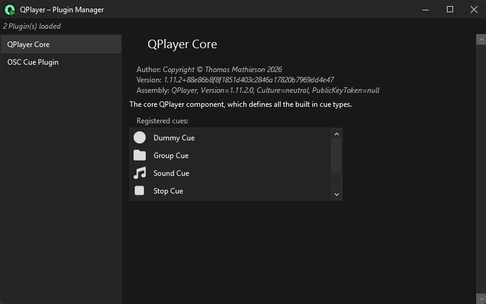

To extend the functionality of QPlayer, plugins can be installed which may add new 
cue types or external connectivity options. Plugins are installed in the `plugins\`
directory in the root of the QPlayer directory (where `QPlayer.exe` is). A plugin
consist simply of a `.dll` built using the QPlayer API.Note that plugins are only 
loaded when starting QPlayer, so if new plugins are installed while QPlayer is 
running, then it will need to be restarted.

To see which plugins have been loaded, the Plugin Manager window can be used, it 
can be opened by going to `Window/Plugins` in the main menu.

