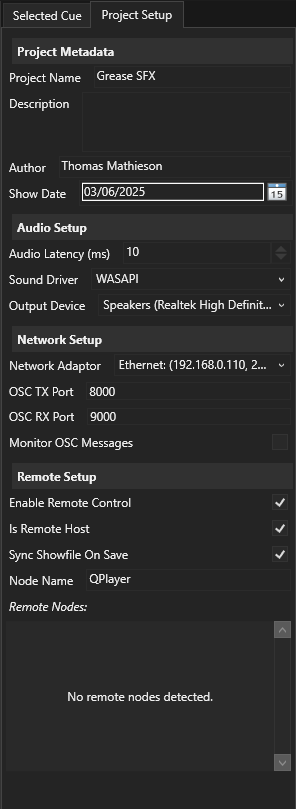

From this panel, global settings related to the QPlayer project can be 
configured. All settings in this panel are saved to the project file.

## Project Metadata

The settings in this section, are simply metadata for the show file, they have
no use outside of this section.

### Project Name

The name of the QPlayer project.

### Description

A longer description of the project, or a place to keep some notes.

### Author

The author of the QPlayer project.

### Show Date

A field to store the show date, or project creation date.

## Audio Setup

In this section, the audio output device(s) can be configured.

### Audio Latency

The desired latency in milliseconds of the audio driver. Note that the total
latency will be slightly higher than what is specified here due to other 
processing overheads. Some audio drivers don't support setting a latency, on
these drivers, this setting has no effect.

Recommended latency settings:  
`Wave` -- 100 ms  
`DirectSound` -- 60 ms  
`WASAPI` -- 10 ms  
`ASIO` -- *setting has no effect* (configure the latency from the ASIO 
          driver)  

### Sound Driver

Which audio driver should be used to output audio. Different audio hardware 
will compatible with different drivers (notably the case for ASIO hardware),
and different operating systems will have different drivers available.

On Windows, the `WASAPI` driver or, if your audio hardware supports it, the
`ASIO` driver is recommended.

### Output Device
Which audio device to output to. 

When saving the project, QPlayer saves the name of the selected output device 
to the project; when attempting to load the project file, it tries to match 
the name in the project file to the names of the available devices, if the 
available audio devices change between saving and reloading the project (or if
the project is loaded on a different computer), QPlayer may fail to find the
selected device.

## Network Setup

### Network Adapter

Which network adapter to use for communication (at the moment this is only 
used for OSC). 

When loading a project from the disk, check this setting is correct in case
your machine's IP has changed since the project was saved.

Note that when attempting to communicate between two OSC devices on the same 
computer, each device may need to be on a separate network adapter so that
they can see each other's messages. This is a limitation of the operating 
system.

### OSC TX Port

The port to send OSC messages to. This should correspond with the RX port
of the device receiving OSC; the exception to this rule is with 
[remote nodes](#remote-nodes), which should have matching TX and RX ports.

When 

### OSC RX Port

The port to receive OSC messages from. This should correspond with the TX 
port of the device sending OSC messages to QPlayer.

### Monitor OSC Messages

When enabled, reports all received and transmitted OSC messages to the log
window (Window/Log Window). This can be useful in debugging whether or not
QPlayer is receiving OSC messages correctly.

## Remote Nodes

QPlayer can control instances of itself running on another computer, or
other software compatible with the protocol defined in 
[OSC Remote](../osc#osc-remote). Remote nodes should each have a unique 
name used to identify them. These nodes will send discovery messages every
second to the network allowing the host QPlayer instance to discover them.
If a remote client isn't heard from in within 5 seconds, the host instance of
QPlayer will show a warning that a node can't be reached. If you can't see a 
node in the (discovery) panel, check the OSC TX and RX ports match and check
your network setup (try pinging the remote node from a command line).

:::note
This section is still under construction.
:::
